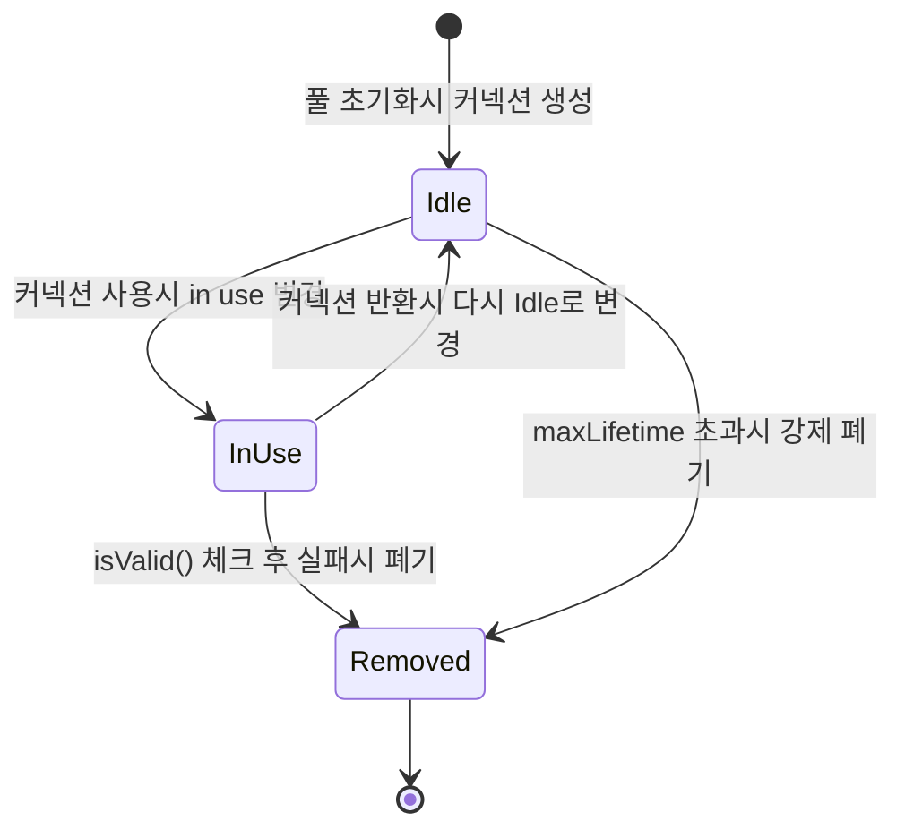

### 벤치마크 리포트

| 버전 | 조건                             | 처리량      | 실패          | 핵심 교훈               |
|----|--------------------------------|----------|-------------|---------------------|
| v1 | 50t/100i, 풀 없음                 | 434/sec  | 0           | 매 요청 22ms 비용 생성     |
| v1 | 250t/200i, 풀없음                 | 277/sec  | 1608        | Too Many Connection |
| v2 | 50t/100i, pool=10              | 3651/sec | 3746        |풀 도입만으로 ~9배 향상|
| v2 | 50t/100i, pool=50              | 1494/sec | 0           |풀이 크다고 좋은 것은 아님|
| v2 | 50t/1000i, pool=10, sleep(100) | 457/sec  | 41,746(83%) |점유 시간이 길면 대기 없는 풀은 무너짐|
