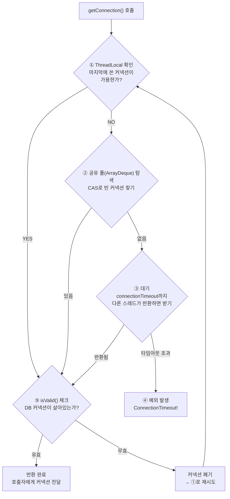

# Week 1, Day 5 — MiniPool v2 설계 문서

> 날짜: 2026-03-27
> 목적: v1의 4가지 문제를 해결하는 v2 설계. 코드 금지 — 설계만.

---

## v1 문제점 → v2 해결 전략

| # | v1 문제 | v2 해결 전략 |
|---|---------|-------------|
| 1 | 풀 비었을 때 대기 없이 즉시 예외 | 시간 기반 대기 (connectionTimeout) |
| 2 | synchronized 글로벌 락 → 경합 | ThreadLocal 힌트 + CAS |
| 3 | ArrayList.remove(0) = O(n) | ArrayDeque로 변경 (O(1)) |
| 4 | 커넥션 유효성 검증 없음 | isValid() 체크 후 반환 |

---

## getConnection() 흐름도



### 텍스트 버전

```
getConnection() 호출
        │
        ▼
┌─────────────────────────┐
│ ① ThreadLocal 확인       │
│ "내가 마지막에 쓴 커넥션" │
│   가용한가?               │
└─────────┬───────────────┘
          │
     YES  │  NO
     ┌────┘────┐
     ▼         ▼
  [⑤로]  ┌─────────────────────────┐
          │ ② 공유 풀(ArrayDeque)    │
          │   CAS로 빈 커넥션 탐색   │
          │   있는가?                │
          └─────────┬───────────────┘
                    │
               YES  │  NO
               ┌────┘────┐
               ▼         ▼
            [⑤로]  ┌─────────────────────────────┐
                    │ ③ 대기                       │
                    │   connectionTimeout까지 대기  │
                    │   다른 스레드가 반환하면 받기  │
                    └─────────┬───────────────────┘
                              │
                     반환됨   │  타임아웃 초과
                     ┌────────┘────┐
                     ▼             ▼
                  [⑤로]    ┌──────────────┐
                           │ ④ 예외 발생   │
                           │ Connection    │
                           │ Timeout!      │
                           └──────────────┘

                ┌──────────────────────────┐
                │ ⑤ isValid() 체크          │
                │   DB 커넥션이 살아있는가?  │
                └─────────┬────────────────┘
                          │
                   유효    │  무효
                   ┌──────┘──────┐
                   ▼             ▼
            ┌──────────┐  ┌──────────────┐
            │ 반환 완료 │  │ 커넥션 폐기   │
            │ 호출자에게 │  │ → ①로 재시도  │
            └──────────┘  └──────────────┘
```

**핵심**: 빠른 경로(①)부터 시도하고, 실패할수록 비싼 경로(②→③)로 내려간다.

---

## release(conn) 흐름도

```
release(conn) 호출
        │
        ▼
┌───────────────────────────────┐
│ 대기 중인 스레드가 있는가?     │
└─────────┬─────────────────────┘
          │
     YES  │  NO
     ┌────┘────┐
     ▼         ▼
┌──────────┐  ┌──────────────────────┐
│ 핸드오프  │  │ 공유 풀에 돌려놓기    │
│ 대기 중인 │  │ ArrayDeque에 add      │
│ 스레드에게 │  │ ThreadLocal 힌트 갱신 │
│ 직접 전달 │  └──────────────────────┘
└──────────┘
```

---

## 각 전략별 트레이드오프

### 1. 시간 기반 대기 (connectionTimeout)

| 장점 | 단점 |
|------|------|
| 실패율 극적 감소 (92% → ~0%) | 대기 시간만큼 응답 지연 발생 |
| 풀 사이즈 < 스레드 수 가능 | 타임아웃 값 설정이 중요 (너무 길면 스레드 낭비) |

### 2. ThreadLocal 힌트 + CAS

| 장점 | 단점 |
|------|------|
| 락 없이 O(1) 획득 (최적 경로) | 스레드당 메모리 추가 사용 |
| 경합 제거 → 처리량 향상 | 구현 복잡도 증가 |
| 캐시 친화적 (같은 커넥션 재사용) | ThreadLocal 누수 주의 필요 |

### 3. ArrayDeque

| 장점 | 단점 |
|------|------|
| 양쪽 끝 O(1) 연산 | ArrayList 대비 인덱스 접근 불편 |
| ArrayList.remove(0)의 O(n) 제거 | 풀 사이즈가 작으면 차이 미미 |

### 4. isValid() 검증

| 장점 | 단점 |
|------|------|
| stale 커넥션 반환 방지 | 매번 호출 시 DB 왕복 1회 추가 |
| 쿼리 실패 사전 차단 | 검증 비용 vs 실패 비용 트레이드오프 |

---

## 오늘의 핵심 한 줄

> **v2의 핵심은 "ThreadLocal → 공유 풀 → 대기 → 타임아웃"의 4단계 폴백 구조다. 빠른 경로부터 시도하고, 실패할수록 비싼 경로로 내려간다.**
