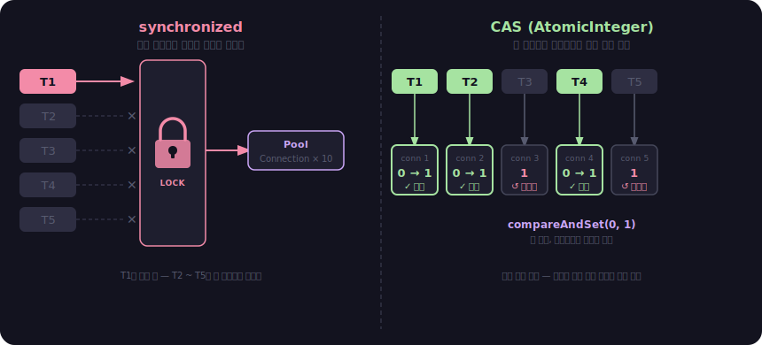
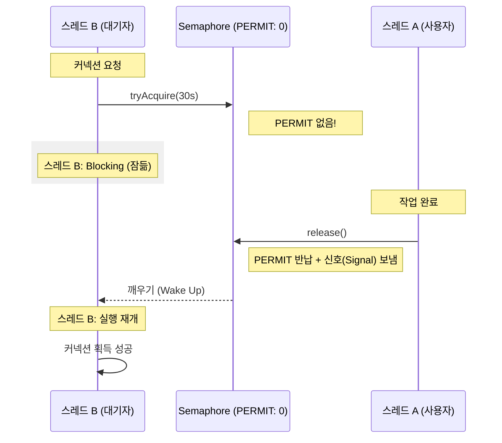
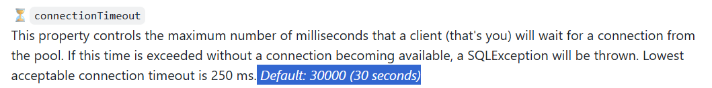
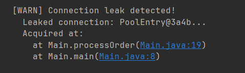

# 커넥션 풀 직접 만들기 (2) - 원시풀에서 

## 이전 요약과 목표
1편에서는 ArrayList와 Synchronized를 활용해서 원시풀을 만들었습니다.
원시풀에서는 3647 req/sec의 처리량을 보여주지만 3000건의 실패를 하기 때문에 위에 대한 실패율이 문제가 되었습니다.

1편의 원시풀의 한계를 살펴본다면 다음과 같습니다.
1. 풀이 비면 대기 없이 즉시 실패
2. Synchronized는 글로벌락이기 때문에 전체 스레드 병목 가능성

그렇다면 이번 편에서는 실패율을 0% 로 만들고, 다양한 감시 기능을 통해서 풀에 대한 상태 가시성을 보장할 수 있도록 합니다.

## Synchronized의 문제점과 해결책
원시풀에서의 문제점은 Synchronized로 인해서 모든 스레드 대기가 한 줄로 대기를 하게 됩니다.
즉, 풀에서의 동시성을 보장하기 위해서 Synchronized로 모든 스레드의 상태를 하나로 잠근 뒤에 진행을 하게 되는데 결국 그렇게 되면 처리량은 떨어지게 되고, 또한 모든 스레드가 하나의 락을 기다리며 직렬화됩니다.

그래서 위에 대한 해결책은 CAS를 통해서 원자적인 연산을 보장하는 방식인데요.

CAS에 대한 자세한 설명은 여기서 진행하지 않고, 여러스레드에서 접근을 하더라도 CAS 알고리즘을 통해 값을 변경하기에 여러 멀티 스레드의 상황에서도 Synchronized보다 높은 처리량을 가져갈 수 있습니다. 

먼저, PoolEntity라는 클래스를 생성했는데 이전에는 단순히 ArrayList에 Connection객체를 넣고 꺼내서 사용했다면, 이제는 PoolEntity를 생성해서 해당하는 PoolEntity의 상태를 변경하도록 하는 것입니다.
```java
public record PoolEntity(
   Connection connection,
   AtomicInteger state // 0 = NOT_IN_USE, 1 = IN_USE
) {}
```
핵심 차이는 그 전에는 Connection을 무조건 꺼내오기 위해서 Synchronized로 대기했다면 이제는 아래와 같이 상태를 확인 후 변경하는 CAS 연산으로 변경했습니다.
```java
poolEntity.state().compareAndSet(0, 1);
```

위의 그림 처럼 중앙 병목지점이 사라지기 때문에 더 높은 처리량을 가질 수 있습니다.

또한 HikariCP의 경우에는 ThreadLocal을 사용해서 성능 최적화를 하는데 그 이유는 스레드가 매번 풀 전체를 순회하지 않고 ThreadLocal을 가져와서 CAS 연산으로 시도하기 때문입니다.
그러면 전체 스레드풀을 순회하지 않아도 되고, 이전에 쓴 커넥션은 같은 스레드가 또 쓸 확률이 높기 때문입니다.

### 테스트 결과
테스트의 조건은 스레드 50에 풀 10 그리고 1000회 반복하여 총 5만건을 각각 진행했습니다.

```
| 버전 |     동기화 방식     |    처리량   |  실패  | 실패율 |
|----|-------------------|-----------|--------|-----|
| v1 |    synchronized   | 6,714/sec | 34,382 | 69% |
| v2 | ThreadLocal + CAS | 7,044/sec | 34,392 | 69% |
```

놀랍게도 처리량은 5%로 미미한 성능 효과를 가지지만, 실패율은 동일한 것으로 파악되었습니다.
CAS로 동기화를 바꿔도 실패율이 그대로인 이유는 사실 실패율의 진짜 원인은 동기화 방식이 아니라 **풀이 비었을 때 즉시 포기하는 설계** 때문입니다.

## 대기 매커니즘 제거하기 - Spin 방식 vs Semaphore
앞선 상황에서 CAS를 도입해서 Lock-free 구조로 동시성은 잡았지만, 실패율이 69%로 동일한 이유는 풀이 비었을 때 포기하는 설계방식 때문입니다.
즉, 만약 풀이 조금의 대기를 하면 스레드가 커넥션을 반납할텐데 이러한 대기가 없기 때문에 **현재의 상황만 보고**판단을 하기 때문에 에러를 뱉습니다.

이러한 방식을 해결하는 가장 간단한 방법은 루프를 돌면서 계속 확인하는 것 입니다.
```java
while (true) {
    if (findAvailableConnection() != null) return conn;
    // 계속 풀이 반환 되었는지 호출 -> CPU 연산 증가
}
```
이 방식은 커넥션을 기다리는 동안 CPU 코어를 계속 점유하기 때문에 시스템 전체를 마비시킬 위험이 있습니다.
왜냐하면, 계속해서 커넥션이 나왔는지 점유중인지 체크하기 때문이죠

HikariCP를 포함한 고성능 풀들은 이러한 문제에 대해서 Semaphore를 선택했습니다.
Semaphore는 카운트를 세서 OS 수준에서 대기를 하도록 합니다.

Semaphore의 장점은 우리가 맛집을 발견할 떄 미리 예약을 걸어두고 다른거를 하는 것과 같습니다.
기다리는 시간이 일정시간이 지나면 취소를 하거나 아니면 그 전에 호출이 되면 식당에 가는 그러한 구조입니다.

```java
if (!semaphore.tryAcquire(poolConfig.connectionTimeoutMs(), TimeUnit.MILLISECONDS)) {
   throw new SQLException("Connection acquisition timeout! (Configured: "+ poolConfig.connectionTimeoutMs() + "ms)");
} 

try {
   // Semaphore에서 PERMIT을 얻은 스레드만 공유 풀에서 CAS로 실물 커넥션 획득 시도
   return findAvailableConnection(); 
} catch (Exception e) {
   // PERMIT 실패 시(예: isValid 체크 실패 등) 반드시 PERMIT을 반납해야 풀 사이즈가 줄어들지 않습니다.
   semaphore.release();
   throw e;
}
```

Semaphore를 추가한 후 다시 벤치마크를 돌려볼 때는, 새로운 결과를 확인할 수 있습니다.
```none
|      구분      | 대기 시간 |   처리량  |      성공      | 실패율 |
| ------------- | ------- | -------- | -------------- | ---- |
| CAS only      |   0ms   | 7044/sec |   ~15,600건    | 69%  |
| Semaphore 추가 | 30000ms | 3602/sec | 50,000건 (전체) |  0%  |
```
처리량 수치는 절반으로 떨어졌지만, 중요한건 기존의 실패율이 69%에서 0%로 감소 했습니다.
7000건을 처리하는데, 그 중에 5000건이 에러라면 의미가 없기에 초당 3600건을 처리해도 한 건의 실패가 없는것이 중요합니다.
그렇기 때문에 Semaphore를 활용해서 대기시간을 걸어 놓아야하는 이유입니다.

그렇다면 semaphore의 connectionTimeout을 짧게 걸어놓는 것이 유리할까요?
아래는 connectionTimeout을 짧게 가져가면서 나온 추가적인 벤치마크 공유입니다.

```none
|      구분      | 대기 시간 |   처리량  |      성공     | 실패율 |
| ------------- | ------- | -------- | ------------- | -- |
| Semaphore 추가 |  100ms  | 3195/sec |   46413건     | 7% |
| Semaphore 추가 | 30000ms | 3602/sec | 50000건 (전체) | 0% |
```

위처럼 connectionTimeout도 트레이드 오프를 가지고 있습니다.
* 짧은 connectionTimeout(1000ms 미만)
1. 빠른 실패 -> 빠른 에러 응답
2. 장애 전파 차단
3. 풀 고갈 빠르게 감지
* 긴 connectionTimeout(30000ms)
1. 느리지만 성공
2. 스레드를 오래 블로킹
3. 스레드풀까지 고갈 될 위험

그렇기 때문에 HikariCP의 기본값은 30초로 설정되어 있습니다.


## HikariCP의 핵심 파라미터 뜯어보기
Semaphore로 실패율 0%를 달성했는데, 여기서 그러면 풀 크기를 늘려서 처리량도 같이 올리는건 어떤가 하는 생각을 가질 수 있습니다.

HikariCP에서 maximumPoolSize라는 옵션을 제공하는데, 문득 이 옵션을 2배로 올리면 성능도 2배가 될 거라고 착각할 수 있지만, 절대아닙니다.
위에 대한 설명보다 벤치마크 결과를 먼저 공유드리겠습니다.

```none
| pool size |   처리량   |  실패율  |
| --------- | --------- | ------ |
|     5     | 2,552/sec |   0%   |
|    10     | 8,124/sec |   0%   |
|    20     | 5,993/sec |   0%   |
|    50     | 7,230/sec |   0%   |
```
처리량을 보면 10일 때가 제일 높고 50으로 늘려도 10보다 낮습니다.
위의 결과가 나오는 이유는 한정된 코어수로는 한정된 작업밖에 못하기 때문입니다.

즉, 커넥션이 많다고 해도 DB가 동시에 처리할 수 있는 양은 코어 수에 의해 결정되기 때문에, 커넥션이 과도하게 많으면 오히려 DB 내부에서 **컨택스트 스위칭 비용이 증가**하게 되고 캐시 효율이 떨어져서 성능이 하락합니다.

그렇다면 커넥션은 몇개가 적정하냐면, 공식 문서상으로는 아래와 같습니다.
```none
connections = (core_count × 2) + effective_spindle_count
```

예를 들어서 4코어 DB서버에 SSD라면 SSD는 spindle 이 0이기 때문에 8개가 적정값이고 공식문서에서는 반올림해서 10개라고 이야기 하기에 pool10 이 최고 성능을 보인 것과도 일치합니다.

아래의 HikariCP의 커넥션과 관련된 글로서 참고하시면 매우 좋습니다.
https://github.com/brettwooldridge/HikariCP/wiki/About-Pool-Sizing

그렇다면 maximumPoolSize 외에 HikariCP에서 제공하는 핵심 파라미터들을 살펴보겠습니다.
사실 connectionTimeout과 maximumPoolSize는 앞선 섹션에서 직접 벤치마크를 통해서 체험했기 때문에, 나머지 3개를 중점으로 다루겠습니다.

- maximumPoolSize (기본값 10) — 풀이 유지하는 최대 커넥션 수. 위의 공식 참고
- connectionTimeout (기본값 30000ms) — Semaphore 섹션에서 다룬 대기 시간
- minimumIdle (기본값 maximumPoolSize와 동일) — 풀이 유지하는 최소 유휴 커넥션 수
- idleTimeout (기본값 600000ms, 10분) — 유휴 커넥션이 이 시간 이상 놀면 제거
- maxLifetime (기본값 1800000ms, 30분) — 커넥션의 최대 수명. 이 시간이 지나면 강제로 교체

minimumIdle의 기본값이 maximumPoolSize와 동일하다는 것은 풀을 항상 꽉 채워두겠다는 뜻입니다.
이렇게 설정한 이유는 만약 minimumIdle이 2이고 maximumPoolSize가 10이라면, 저번주에 봤듯이 스파이크 상황에서 커넥션을 생성하는 비용이 높아져서, 빠르게 대응할 수 없기 때문입니다.

또한 idleTimeOut과 maxLifetime은 왜 설정하는지 의문을 가질 수도 있는데, 그 이유는 DB가 먼저 커넥션을 끊을 수 있기 때문입니다.
MySQL의 wait_timeout 기본값은 28800초 (8시간) 이기에, DB는 이 시간 동안에 아무 요청이 없는 커넥션을 일방적으로 끊어버립니다.

그러나, 애플리케이션은 그러한 사실을 모르기 때문에 만약 8시간 10분 동안 애플리케이션을 사용하지 않고 그 이후에 사용할 경우에는 풀에 있는 커넥션 객체는 살아있는 것처럼 보이지만, 실제로는 이미 끊긴 상태로서 그 커넥션에 쿼리를 보내면 에러가 발생하기 때문에 DB가 끊기 전에 애플리케이션에서 먼저 교체하는 전략이 필요합니다.
그래서 maxLifetime은 DB의 wait_timeout보다 짧아야하고, 공식 문서에서는 최소 30초이상 짧게 설정하라고 권장합니다.

## 커넥션 누수 잡기

파라미터를 아무리 잘 튜닝해도 코드에서 getConnection()을 호출하고 release()를 안하면 그 커넥션은 영원히 IN_USE 상태로 남게 됩니다.
풀 입장에서는 누군가 쓰고 있다고 생각해서 다른 스레드에 남겨줄 수 없고, 이런 커넥션이 쌓이면 결국 풀이 고갈됩니다.

문제는 이러한 커넥션의 종료를 어떻게 감지하냐는건데, release()가 호출되지 않았다는 것은 release() 시점에서는 잡을 수 없다는 의미입니다.
왜냐면 애초에 호출이 되지 않았기 때문입니다.

그렇기 때문에 감지 시점은 getConnection() 입니다.
커넥션을 꺼내는 순간에 Throwable을 캡쳐해서 스택트레이스를 저장해두고, 별도의 감시 스레드가 일정 시간이 지나도 반환되지 않은 커넥션을 찾으면 저장해둔 스택트레이스를 출력하는 방식입니다.

```java
PoolEntry entry = findAvailableConnection();
entry.setLeakTrace(new Throwable("Leak detection"));
entry.setAcquiredTime(System.currentTimeMillis());
```

감시 스레드는 주기적으로 풀을 순회하면서, acquiredTime으로 부터 leakDetectionThreshold 이상 경과된 커넥션을 찾아 경고를 출력합니다.
아래는 실제 누수를 발생시켜 테스트한 것으로, 정확히 누수가 어디에서 발생되었는지 코드를 찍어줍니다.



release()를 빠트린 geConnection() 호출 위치를 알려주기 때문에 프로덕션에서 누수 원인을 빠르게 추적할 수 있습니다.
다만, 여기서 주의할 점은 leakDetectionThreshold 설정 시에 주의가 필요합니다.
왜냐하면 실제로 쿼리가 leakDetectionThreshold 보다 긴 쿼리를 테스트 (sleep() 사용도 가능) 할 때 오래 걸리는 쿼리도 누수로 오탐하기에, 가능하다면 서비스의 p99 응답시간보다 길게 설정하는 것이 좋습니다.

## 풀 상태를 확인하는 Metrics

누수 감지까지 구현을 했지만, 프로덕션 상황에서는 문제가 터지기 전에 풀 상태를 실시간으로 파악할 수 있어야 합니다.
HikariCP에서 제공하는 핵심 매트릭은 4가지입니다.

* active : 현재 사용 중인 커넥션 수
* idle : 풀에서 대기 중인 커넥션 수
* pending : 커넥션을 기다리고 있는 스레드 수
* total : 풀의 전체 커넥션 수 (active + idle)

이 중에서 가장 긴급한 신호는 pending > 0 이 지속되는 상황입니다.
왜냐하면 이러한 뜻은 커넥션을 원하는 스레드가 있는데 줄 커넥션이 없다는 뜻이기 때문입니다.

실제 벤치마크 중 매트릭을 출력할 때 아래의 상황을 발견했습니다.
```none
action = 20   /   idel = 0   /   pending = 30   /   total = 20
```

풀이 완전히 소진된 상태지만 가장 중요한 점은 단순히 숫자만 보고서 원인을 파악하는 것은 불가능합니다.

같은 active=20, pending=30 이더라도 원인은 여러가지입니다.
* 슬로우쿼리로 인한 커넥션 문제
* 누수로 인한 커넥션 반납문제
* 트래픽이 폭증한 경우

이러한 다양한 이유로 매트릭은 문제가 있다는 것을 알려주는 신호일 뿐 정확한 파악은 커넥션 누수 감지나 슬로우 쿼리 로그 감지 같은 별도 수단들을 필요로 합니다.

---


