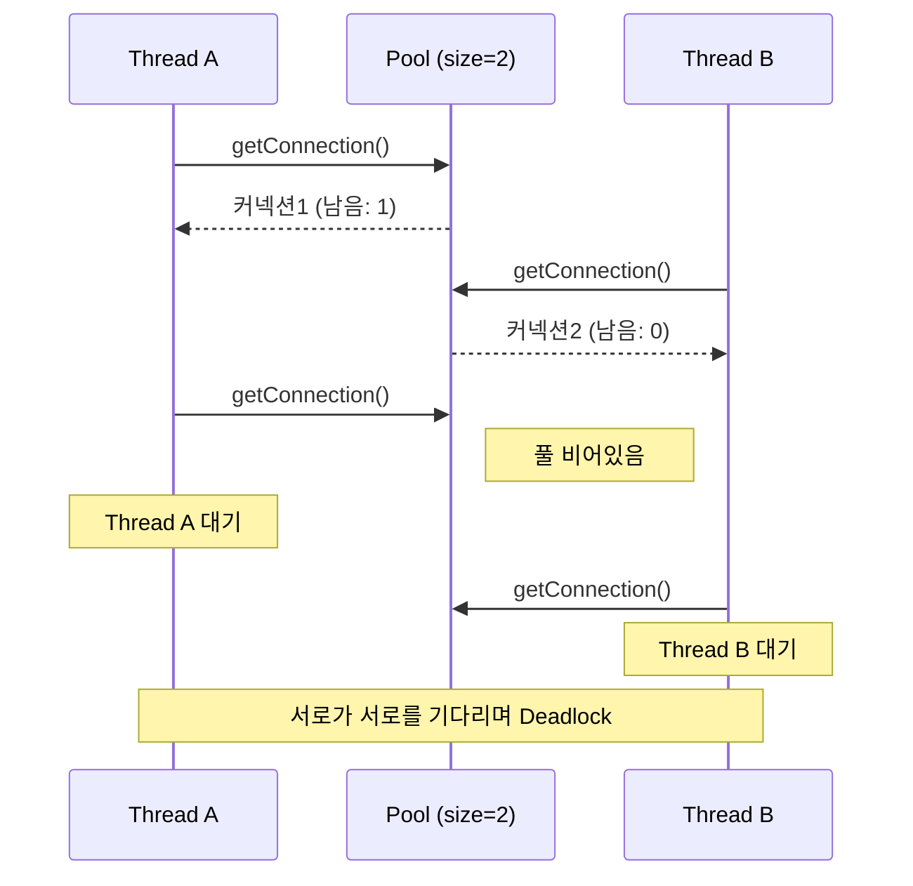
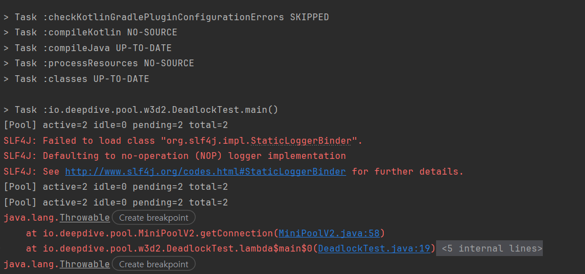

# 커넥션 풀 직접 만들기 (3) - 프로덕션에서의 장애 상황 겪어보기

## 1. 이전 편 요약 + 이번 편 목표
2편에서는 1편의 원시풀이 가지고 있던 synchronized 병목과 즉시 실패하는 설계를 걷어냈습니다.
CAS로 동기화 방식을 변경했지만, 실패율은 69% 그대로였고, 진짜 원인은 **풀이 비면 포기하는 전략이기 때문에** Semaphore를 도입해서 실패율을 0%로 만들었습니다.
이후에 maximumPoolSize 같은 핵심 파라미터 5개에 대해서 정리했고, 누수 감지와 active, idle, pending, total 까지 붙여서 풀에 대한 가시성까지 확보했습니다.

정리하자면, 2편에서는 **풀을 잘 만드느 방법**에 집중해서 성능을 올리고, 실패를 줄이고, 상태의 가시성을 확보할 수 있게 하는 것까지가 2편에서의 영역이었습니다.

이번에서는 풀을 직접 터트려서, 프로덕션에서 실제로 발생할 수 있는 장애 시나리오를 Claude 로 만들어 보고, 그런 일이 벌어지는 이유와 이에 대한 방어들을 알아보면서 제가 공부한 내용들을 회고하려고합니다.
전체적으로 진행할 장애 상황은 아래와 같습니다.

1. 커넥션 고갈 3패턴
2. REQUIRES_NEW 데드락
3. maxLifetime 충돌 + jitter
4. isValid 검증 시점 트레이드오프
5. MiniPool VS HikariCP 회고

## 2. 풀 고갈에 대한 같은 증상, 다른 원인
저번 편 마지막에 매트릭을 붙히면서 마지막에 확인했던 부분은 `active=20, idle=0, pending=30, total=20` 와 같은 상황입니다.
풀이 완전히 소진된 상태지만 그 당시에 유추한 바로는 매트릭의 증상은 같더라도 그에 대한 원인은 여러가지입니다.

그래서 이번에는 풀이 고갈되는 3가지 패턴을 Claude를 통해 재현하고, 어떻게 매트릭이 다른지를 비교한 것을 공유하겠습니다.
시나리오는 다음과 같습니다.

1. 느린 쿼리 : 쿼리 하나가 오래 걸려서 커넥션을 오래 붙잡는 상황
2. 트래픽 폭증 : 순간적으로 요청이 몰려서 풀이 일시적으로 Max인 상황
3. 커넥션 누수 : release()가 호출되지 않아서 커넥션이 영원히 IN_USE로 남는 상황

### CASE: 느린 쿼리
느린 쿼리는 가장 흔한 패턴입니다.
저의 짧은 경험이 아닌 실제로 쿼리는 빈번하게 느려질 수 있고, 레코드 수가 적더라도 다양한 이유에 의해 쿼리가 느려지는데 예를 들어 실제 운영 환경에서 인덱스가 없는 쿼리가 5초씩 걸린다고 가정하면, 단순하게 Thread.sleep() 을 써서 진행을합니다.

```java
try (Connection conn = pool.getConnection()) {
    // 5초 걸리는 쿼리를 흉내내기 위한 sleep
    Thread.sleep(5000);
    // 실제 쿼리
}
```

이 코드로 50개의 스레드가 동시에 요청하면, 풀 사이즈가 10인 환경에서는 매우 빠르게 active=10, pending=40까지 치솟습니다.
하지만 5초가 지나서 커넥션이 반환되고 pending 이 감소하면서, 쿼리가 끝나는 시점에 매트릭이 정상적으로 돌아옵니다.

이렇게 느린 쿼리로 인한 고갈의 특징은 트래픽이 치솟고 시간이 지나면 회복되는 것 입니다.
그래서, 장애에 발생한 당시의 매트릭에서는 매우 치명적이지만 시간이 지나면 다시 원래대로 돌아옵니다.

### CASE: 트래픽_폭증
트래픽 폭증은 순간적으로 QPS가 튀어서 스레드들이 한꺼번에 많은 커넥션을 요구하는 상황입니다.
예를 들어서, 평소 50TPS인 서비스가 어떠한 이벤트나 프로모션으로 인해서 10배 의 TPS를 받는 경우 입니다.

이 경우에는 풀은 즉시 꽉 차고 pending이 급증하게 되지만 쿼리 자체의 속도는 정상 속도여서 Semaphore에서 순차적으로 대기 스레드를 깨워서 빠르게 소화를 합니다.
또한 connectionTimeout 설정 때문에 실패율은 0%를 유지할 수 있습니다.

느린 쿼리와 비슷하지만 가장 큰 차이는 느린 쿼리는 active가 꽉 차있는 상태로 시간이 흐르지만, 위의 케이스는 active는 차 있지만, pending이 빠르게 감소합니다.

### CASE: 커넥션_누수
가장 위험한 패턴으로서, release()를 빠트린 코드가 배포되면 커넥션은 영원히 IN_USE 상태로 남습니다.
```java
Connection conn = pool.getConnection();
// conn.close(); 누락
```

이 상태에서 요청이 계속 들어오면 active는 절대 내려가지 않고 결국 풀이 고갈됩니다.
앞의 두 패턴과 다르게 시간이 지나도 회복되지 않다는 점 입니다.

결국은 Leak Detector가 작동해서 leakDetectionThreshold를 초과한 커넥션의 스택트레이스를 경고로 찍어줍니다.

아래는 위의 내용에 대해서 표로 정리한 내용 입니다.
```none
  |      원인      | active 추세 | pending 추세 |   회복 여부   |    감지 신호    |
  | ------------- | ---------- | ----------- | ----------- | -------------- |
  |  느린 쿼리    | 순간 상승   | 순간 상승    | 자동 회복    | slow query log |
  |  트래픽 폭증  | 꽉참 유지   | 상승 후 감소 | 트래픽 감소시 | QPS 추세       |
  |   누수       | 영구 고정   | 점점 누적   |  회복 불가   | Leak Detector 경고 |
```

중요한 사실은, 매트릭으로는 단순히 3가지를 구분할 수 없습니다.
단순하게 active=10, pending=30 이라는 순간만 본다면 모든 경우의 수에 맞는 상황이기때문입니다.
그렇기 때문에 로그와 외부지표 그리고 모니터링 등등을 통해서 다양한 환경을 동시에 해석해야 원인을 좁힐 수 있습니다.


## REQUIRES_NEW를 피하자
이번 파트에서는 재미있는 퀴즈를 해보려고 합니다.
Hikari 풀의 값은 2개라고 가정하고, 다음의 코드에서는 어떤 문제가 생길까요!

```java
  PoolConfig poolConfig = new PoolConfig(2, 5000, 2000, 5000);
  MiniPoolV2 pool = new MiniPoolV2(connectionInfo, poolConfig);
  ExecutorService executor = Executors.newFixedThreadPool(2);

  for (int i = 0; i < 2; i++) {
      executor.submit(() -> {
          pool.getConnection(poolConfig.connectionTimeoutMs()); // 1개 획득
          pool.getConnection(poolConfig.connectionTimeoutMs()); // 2개째 요청
      });
  }
```

정답은 **데드락** 상태에 빠집니다.

이유는 다음과 같습니다.
1. 스레드 A가 커넥션 획득 (풀 1개)
2. 스레드 B가 커넥션 획득 (풀 0개)
3. 스레드 A가 2번째 요청 -> 풀 없어서 대기
4. 스레드 B가 2번째 요청 -> 풀 없어서 대기

결국 둘 다 서로의 커넥션을 놓지 않아서 서로를 기다리다 데드락이 발생되고, 매트릭에서는 active=2, pending=2가 영구 고정되다가 connectionTimeout() 설정 시간 후 SQLException이 터지고 풀립니다.



이게 시사하는 바는 어떤것일까요?
바로 @Transactional에서 Propagation을 REQUIRES_NEW로 설정하게 되는 경우입니다.
예를 들어 Transaction 내부에서 여러 트랜잭션을 부득이하게 전파해야하는 경우에 REQUIRES_NEW를 선언하는 경우가 있는데, 이유나 위에 대한 단점 그리고 왜 그런지 동작 방식은 여기서 서술하지 않겠습니다!
Transactional 직접 만들 때 설명하겠습니다! 하하 😊
이렇게 되면 새로운 커넥션을 형성하게 됩니다.

그렇기 때문에 결국 데드락이 걸리는건 단순 풀 사이즈 문제가 아니라 pool=10이여도 스레드 10개가 만약 각자 REQUIRES_NEW를 타게 되면 똑같이 걸리게 됩니다.
위에 대한 방지법은 크게 3가지 입니다.

1. REQUIRES_NEW를 되도록 사용하지 않기
2. 풀 사이즈 공식 맞추기 = pool_size = 스레드수 * (스레드가 동시에 사용하는 최대 커넥션 수 - 1) + 1
3. 별도의 풀로 분리

즉, 풀 사이즈보다 한 스레드가 동시에 몇 개의 커넥션을 필요로 하는가가 중요합니다.

## 4. 커넥션은 이미 죽어있다
저번주에 간단하게 maxLifetime에 대해서 이야기를 했는데, 기본값을 30분으로 설정한 것은 DB의 wait_timeout보다 짧게 잡아서 DB가 먼저 커넥션을 끊기 전에 애플리케이션이 먼저 교체 하는 설정이라 했습니다.

사실 풀은 커넥션이 살아있다고 생각하고 보관을 합니다.
하지만, MySQL의 wait_timeout의 기본값은 8시간이고, 이 시간 동안 요청이 없는 커넥션은 DB가 일방적으로 끊어버립니다.
그리고 끊었다는 사실을 PING 해주지 않습니다!
애플리케이션 입장에서는 커넥션 객체가 살아있는 것처럼 보이지만, 실제로는 이미 죽은 커넥션이기 때문에 이 커넥션으로 쿼리를 보내면 에러가 발생합니다.

그래서 HikariCP에서는 maxLifetime의 기본로직을 30분으로 두고, 그 시간이 지난 커넥션은 반납 시점에 폐기하고 새로 만들어서 교체합니다.
이러한 것은 2주차에서도 동일하게 구현했습니다.
```java
  PoolConfig poolConfig = new PoolConfig(10, 5000, 2000, 3000); // maxLifetime=3000ms
```

하지만 갑자기 모든 풀이 동시에 만료가 된다면 어떻게 될까요?
그렇게 되면 사실 콜드스타트가 되기 때문에 10개의 커넥션을 한꺼번에 생성하는 비효율성을 증가 시킵니다.
그래서 이러한 부분을 해결하기 위해서는 바로 **jitter**를 사용합니다.

HikariCP에서는 각 커넥션의 maxLifetime에 작은 랜덤 오프셋을 더해서, 만료 시점을 랜덤하게 흩뿌립니다.
```java
  // 예: 기본 3000ms + 랜덤 오프셋(0~300ms)
  long lifetime = maxLifetime + ThreadLocalRandom.current().nextLong(maxLifetime / 10);
```

이렇게 하면 10개의 커넥션의 만료 시점이 오차범위 내부인 10%로 분산되서 한꺼번에 폐기되는 상황을 방지합니다.

```none
  |           | 적용 전              | 적용 후                |
  | --------- | ------------------- | --------------------- |
  | 만료 시점  | 같은 순간에 10개 몰림   | ±10% 범위로 분산        |
  | 풀 상태   | 30분마다 일시 고갈      | 꾸준히 유지됨            |
  | 사용자 영향| 주기적 지연 스파이크    | 거의 없음                |
```

## 5. 커넥션 검증의 시점
